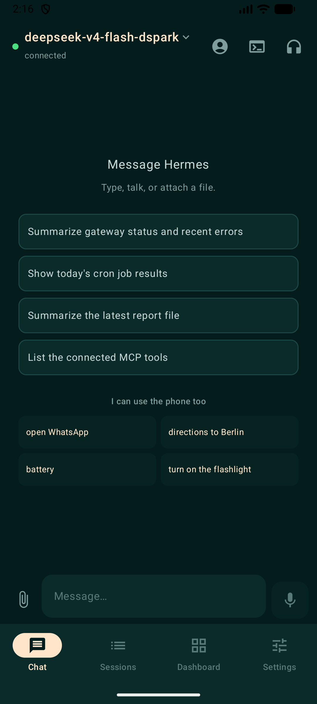
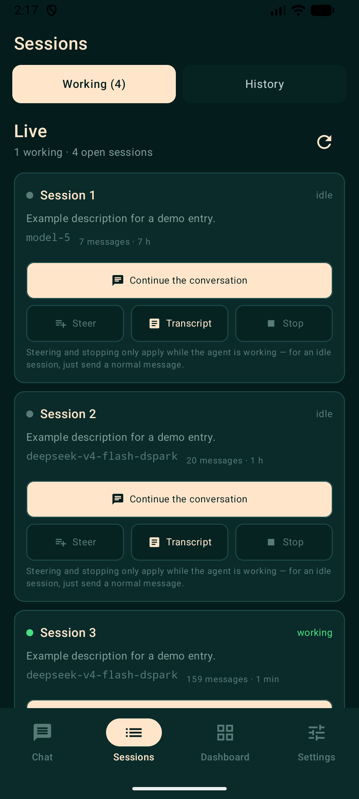
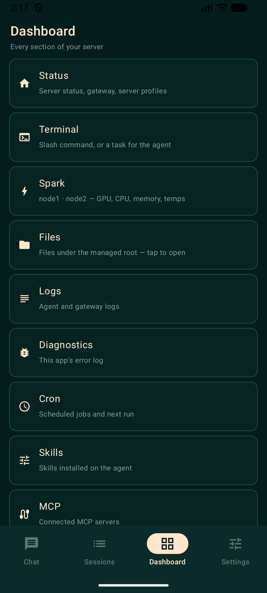
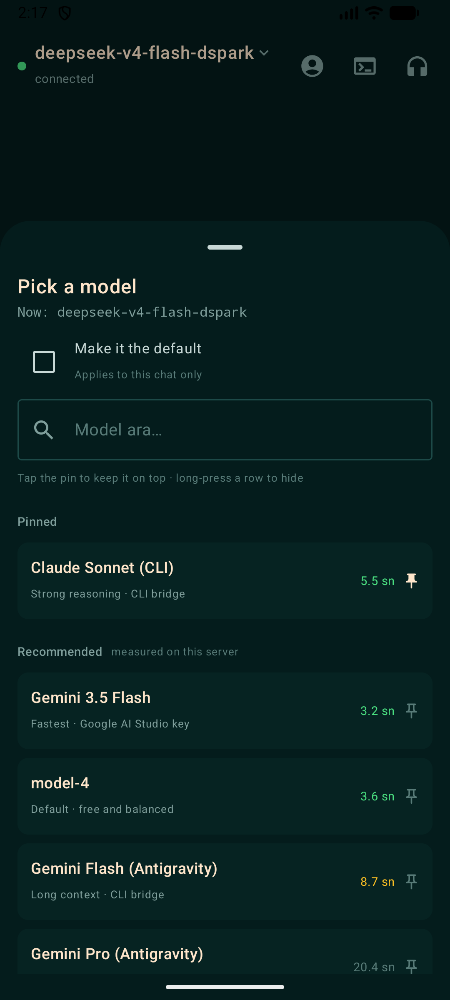
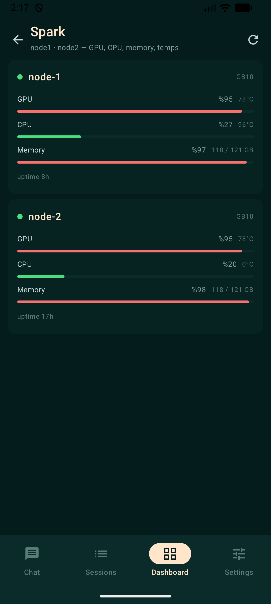
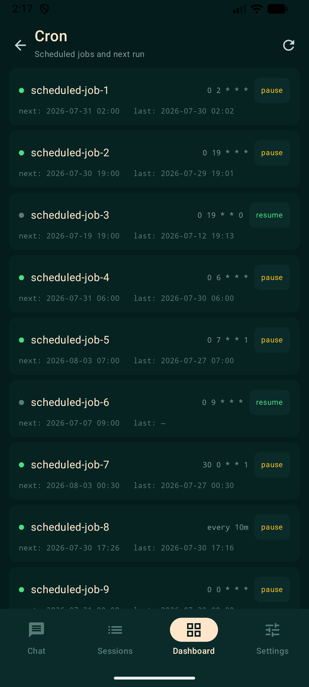
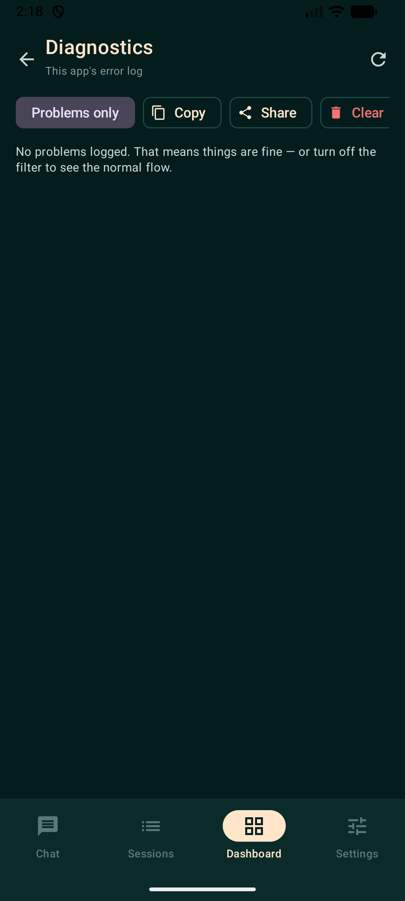
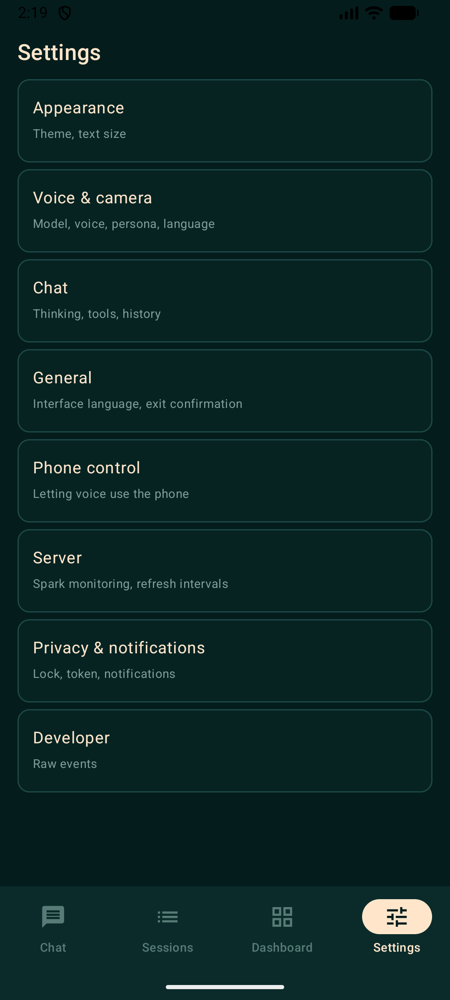

<div align="center">

# Hermes Mobile

**A native Android client for a self-hosted AI agent.**

Your server. Your phone. Your model keys never leave either.

[](#build-it)
[](https://kotlinlang.org)
[](https://developer.android.com/compose)
[](#why-this-exists)
[](LICENSE)

[Build it](#build-it) · [Connect your server](#connect-your-server) · [Phone control](#the-agent-can-use-the-phone) · [Report a bug](https://github.com/Jilazem/Hermes-Mobil/issues)

</div>

Hermes Mobile turns an Android phone into a first-class surface for an agent
running on hardware you own. The phone handles interaction — chat, live voice,
camera, and the phone itself. Your server keeps running the agent, its tools,
its memory, and its schedule.

- **Client only.** No hosted account, no cloud relay, no analytics, no
  telemetry. Point it at your own server or it does nothing.
- **Actually native.** Compose UI, notifications with inline reply, share
  target, app shortcuts, Quick Settings tile, Android Auto, digital-assistant
  role. No WebView anywhere.
- **Keys stay on the server.** Live voice runs through a small relay on your
  machine, so the Gemini key is never on the phone.
- **Degrades instead of failing.** Messages typed offline queue and flush on
  reconnect, the session list stays readable from a local cache, and a
  dropped socket re-attaches to the same agent session.

---

## Screenshots

<p align="center">
  
  
  
  
</p>
<p align="center">
  
  
  
  
</p>

<p align="center"><em>Chat · sessions · dashboard · model picker · GPU monitoring · cron · diagnostics · settings</em></p>

Names in these screenshots are aliased. The app has a demo mode
(Settings → Developer) that masks server-supplied text — session titles, job
names, skills, hostnames, file paths — so screenshots can be shared without
leaking anything. Measured with it off, 9 of 14 screens showed something
personal; with it on, none do.

---

## What it does

### Chat and sessions

- Streaming replies over the agent's WebSocket protocol, with thinking
  blocks, tool-call cards, and approval prompts for dangerous commands.
- Attach images and files; share text or media into a new chat from any app.
- **Steer a running agent.** A session started from Telegram, a cron job, or
  the CLI shows up here *while it runs* — you can inject a message into its
  turn or redirect the turn without discarding the work already done.
- Session continuity across app kills; the last session is restored, falling
  back to the most recent one if the server has expired it.
- Offline composer: messages queue and send themselves on reconnect.

### Live voice and camera

- Bidirectional audio through the Gemini Live API with barge-in, proxied by a
  small relay (`relay/`) so the API key stays on your server.
- Full-screen camera for "describe what you see". The preview runs in the main
  window rather than a bottom sheet — `PreviewView` needs the main window's
  surface hierarchy to render on real hardware.
- Driving mode: a foreground service keeps the microphone alive with the
  screen off.
- Android Auto shows agent/server status; voice itself runs on the phone and
  reaches the car over Bluetooth, because the Car App Library cannot own the
  microphone.
- Offline voice, on-device: the TTS engine can be switched to a local Piper
  female voice (`tr_TR-fettah`, ~63 MB one-time download via
  sherpa-onnx) — text never leaves the phone when it is selected, and the
  cloud path gains a local fallback when synthesis fails. The live-assistant
  brain can also point at a LAN OpenAI-compatible endpoint
  (`/v1/chat/completions`) instead of Gemini; that choice is a lock, not a
  preference — if the local node is down the app shows an error and stays
  local. It never silently falls back to the cloud.

### The agent can use the phone

Typed and spoken commands resolve **on the device** — no round trip, no model
call, no network:

```
open WhatsApp          directions to the station       battery
turn on the flashlight set a timer for 10 minutes      call Ahmet
what did I miss?       where am I?                     what's on today?
```

Both halves matter. **Writing:** open apps, dial (the dialer opens, you place
the call), draft an SMS, navigate, alarms, calendar events, timers, volume,
media, flashlight, web search, Tasker tasks, MacroDroid webhooks.
**Reading:** contacts, notifications, calendar, location, clipboard — without
these the assistant knows nothing about the phone it lives on, and "call
Ahmet" means memorising a number.

Matching is a small rule set, not a model: bilingual (Turkish/English), with
diacritic folding so `aç` and `ac` both work. No match means the message goes
to the agent untouched — returning nothing is better than guessing wrong.

Permissions are granted individually in Settings → Phone control, and nothing
is required. Anything you don't grant just disables that one capability.
Deeper control (Wi-Fi, Bluetooth, DND, shell) is available through
[Shizuku](https://shizuku.rikka.app/) and is off by default.

### The agent can reach the phone, too

The commands above run when **you** type or speak them. That left half the
problem unsolved: an agent started by cron, Telegram or the CLI could never
touch the phone, so "read me my notifications at 8am" was not expressible.

The fix is to reverse the direction. The phone opens an **outbound**
WebSocket to a small bridge on your server, and the agent reaches it through
an MCP tool server:

```
Phone ──WS(outbound)──> phone_bridge.py :9180 <──HTTP──> phone MCP ──> agent
```

Because the phone dials out, NAT, CGNAT and mobile data stop mattering — no
port forwarding, no VPN, no USB. Remote access reuses the same reverse-proxy
path trick as live voice (`/phone-bridge/*`).

Off by default, and read-only when first enabled. The rules are deliberate:

- **The phone decides what runs, not the bridge.** The bridge only forwards.
  The user's current consent lives on the phone, so an allowlist on the
  server would be a security feeling that nothing enforces.
- **Nothing irreversible is exposed.** Dialling opens the dialer, SMS stays a
  draft. `phone_shell` and the Shizuku tools are not on this channel at all.
- **A persistent notification stays up while the channel is open.** A remote
  access path into your phone should never be invisible.
- Every call is written to the diagnostics log.

Two tools exist only for this direction: `phone_notify` and `phone_speak` —
the agent reaching *you*, rather than only answering when asked.

### Server dashboard

Status, terminal, files, logs, scheduled jobs (pause/resume/reschedule/run),
skills, MCP servers, webhooks, pairing, raw config — plus GPU/CPU/memory and
temperatures from one or more
[sparkDash](https://github.com/MiaAI-Lab/sparkDash) nodes.

### Diagnostics

Most failures in a mobile agent client are silent — a socket closes and the UI
keeps saying "Thinking", a schema changes and a list comes back empty, and
`adb logcat` only helps when the phone is on a cable. So the app keeps its own
log: crashes, WebSocket close codes, HTTP status plus which address was tried,
JSON decode failures, session re-attach, the offline queue.

Secrets are redacted as entries are written rather than when they are
displayed, so the log is safe to copy and send. That redaction has its own
tests — one of them caught a real leak where `Authorization: Bearer <token>`
matched only the word `Bearer` and left the token in the clear.

---

## Connect your server

This is a client. It does not include, host, or provision a backend — you need
your own agent server reachable from the phone, and keeping it running and
secured is your job.

The app stores server profiles, tokens, and keys in
`EncryptedSharedPreferences` backed by the Android Keystore. Nothing is
written to plain files and nothing is committed to this repo.

### On your home network

Enter the server's LAN address, for example `http://192.168.1.10:9150`, plus
its session token. Plain HTTP is allowed for private addresses and rejected
for public hosts.

### From outside — reverse proxy

The recommended route. Put the agent behind a proxy that terminates real TLS
on a hostname you control, then use `https://hermes.example.com`.

Live voice needs the relay reachable too. Rather than opening another port,
mount it as a **path on the same origin** — this works even when the domain
resolves to a router's cloud proxy and extra ports cannot be forwarded at all:

```caddy
:9150 {
    handle_path /live-relay/* {
        reverse_proxy 127.0.0.1:9170
    }
    reverse_proxy 127.0.0.1:9120
}
```

The app derives the address itself: `ws://<lan-ip>:9170` on your network,
`wss://<host>/live-relay` from outside. The relay verifies the same token the
app already holds and closes unauthorised sockets with code `4401`.

### From outside — Tailscale

Put the server and the phone on the same tailnet and use the tailnet address.
Nothing is exposed to the public internet.

### Connection troubleshooting

If the app cannot reach the server, check in this order:

1. The server machine is awake and the agent is running.
2. `/api/status` responds from another device on the same route.
3. The proxy, tunnel, or tailnet is up — and the certificate is valid.
4. The URL has the right scheme and port, and the token matches the server's.
5. **Open Dashboard → Diagnostics.** It records which addresses were tried and
   why each failed; that answers most of the above in one screen.

---

## Build it

There is no signed release yet — build the debug APK, or produce your own
signed build. Requires JDK 17 and Android SDK Platform 35.

```powershell
$env:ANDROID_HOME="$env:LOCALAPPDATA\Android\Sdk"
$env:ANDROID_SDK_ROOT=$env:ANDROID_HOME
./gradlew.bat testDebugUnitTest
./gradlew.bat assembleDebug
```

Output: `app/build/outputs/apk/debug/app-debug.apk`

The relay is a single Python file (`relay/gemini_live_relay.py`) run as a
systemd user service on the machine hosting the agent. It reads the Gemini key
and the session token from the environment; neither is ever sent to the phone.

Because the app is sideloaded, Android Auto needs "Unknown sources" enabled in
Auto's developer settings — Play Store distribution does not accept
general-purpose assistants.

---

## Server compatibility

Tested against the server build pinned in
[`UPSTREAM_TESTED.md`](UPSTREAM_TESTED.md). The upstream agent does not
guarantee API stability, so a different version can break individual panels
while the rest keeps working. **Include your server version when reporting a
bug** — the app shows it under Dashboard → Status.

That file also carries the decoding rules, and they are not decorative: twice
a field that used to be a string started arriving as an object, and both times
a panel came back empty with nothing in the UI to explain why. Decode
tolerantly, use `JsonElement` for shapes that have already moved once, and let
one panel fail without taking the app down.

---

## Project map

- [`app/src/main/java/com/hermes/mobile/data/`](app/src/main/java/com/hermes/mobile/data/)
  — networking, phone tools, on-device intent parsing, diagnostics, storage.
- [`app/src/main/java/com/hermes/mobile/ui/`](app/src/main/java/com/hermes/mobile/ui/)
  — Compose screens; `Strings.kt` holds the bilingual layer.
- [`app/src/test/`](app/src/test/) — unit tests for intent parsing, relay URL
  derivation, and log redaction.
- [`relay/`](relay/) — Gemini Live relay, plus the agent→phone bridge and
  its MCP tool server.
- [`UPSTREAM_TESTED.md`](UPSTREAM_TESTED.md) — pinned server build and
  decoding rules.

---

## Acknowledgements

**[Hungbocluaqua/hermex-android-port](https://github.com/Hungbocluaqua/hermex-android-port)**
— thank you. That project is a native Kotlin/Compose Android port of
[hermex](https://github.com/uzairansaruzi/hermex), a client for a different
self-hosted agent, and reading it directly improved this one. Borrowed with
credit:

- **Pinning the tested server build** and writing the tolerant-decoding rules
  down as project policy instead of learning them per crash. This repo had
  already been bitten twice by the same class of bug; hermex had it
  formalised.
- **Offline awareness as a stated property**, not an accident — which is what
  prompted the local session cache here.
- The README shape you are reading: the value bullets up front, connection
  routes as named options, and a troubleshooting checklist rather than prose.

Independent implementations, different servers, no shared code.

Also:

- **[MiaAI-Lab](https://github.com/MiaAI-Lab/sparkDash)** for sparkDash — the
  GPU monitoring panel is a thin client over their API, which made it an
  afternoon instead of a metrics pipeline.
- **[Nous Research](https://nousresearch.com/)**, whose Portal is one of the
  model providers the picker routes to.
- **[Claude](https://claude.com/claude-code)** (Anthropic) — pair programmer
  for this client, including the debugging sessions that found a black camera
  preview reproducing only on real hardware and a stale-session dead end.

---

## Privacy

Personal identifiers, internal hostnames, tokens, and private addresses are
stripped before anything is published here, and the check runs as a build step
that fails rather than warns. If you fork this, point it at your own agent and
keep credentials out of source — the app reads them from encrypted storage at
runtime.

## License

MIT — see [LICENSE](LICENSE).

Not affiliated with Google or Anthropic. Android, Jetpack, and Google Play are
trademarks of Google LLC.
